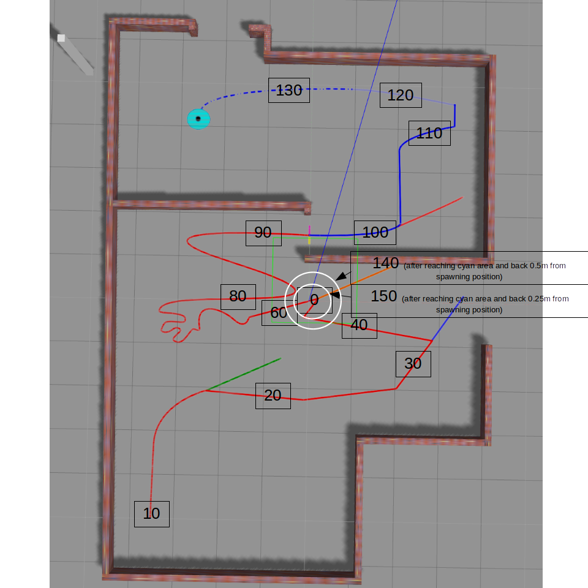

# Ceerii Line-Following Bot

  

 

## Project Description
This is created for the course, "Robot Guidance & Software". The goal for the project includes using a differential robot to find a line, follow it and get back to its original location. The rules I had to follow include: 
- Use the differential robot (maybe slightly modified) and the given world.
- Start at position 0,0 (spawning position), where there are white circles with "0" on the above picture.
- Go to the beginning of the line (the red line which begins in the bottom left corner).
- Follow the line using a camera to detect it.
- Don't take shortcuts in the line: follow the line.
- When the line color changes, make the correct decision which color to follow.
- When you reach the cyan area in the end, go back to 0,0 (spawning position) and stop here. It is up to you whether you follow the line to get back there or if you follow some other algorithm.
- Everything is done autonomously.
- Everything starts with a launch file named "line_following_<student_code>.launch"     
&nbsp;

## Project Design

To be continued :)
